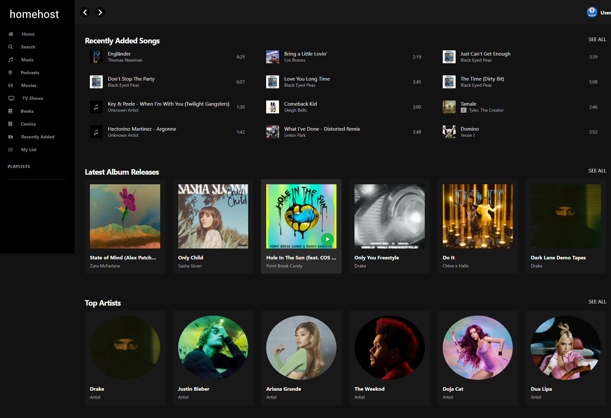
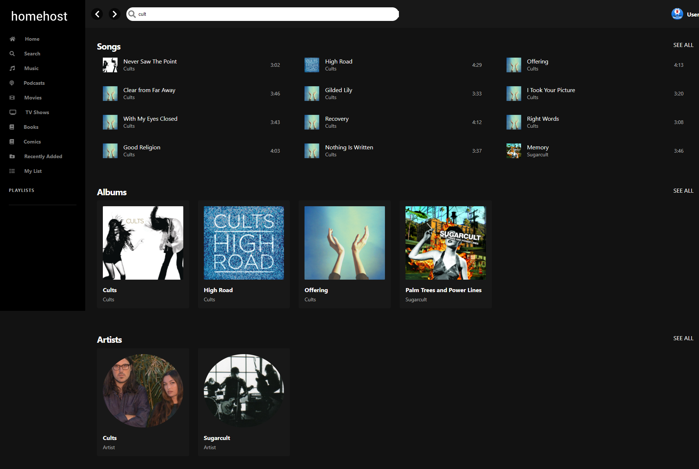

<h2 align="center"> homehost </h2>

<h3 align="center"> homehost is made for streaming your media collection within the home network </h3>
<h4 align="center"> Features: 🎥 Movies, 📺 TV Shows, 🎵 Music, 📚 Books, 📒 Comics, 🎙️ Podcasts </h4>

  * [🎥 Movies](#-movies)
  * [📺 TV Shows](#-tv-shows)
  * [🎵 Music](#-music)
  * [⚙️ Setup](#%EF%B8%8F-setup)
    + [Naming conventions](#naming-conventions)
    + [Generating metadata](#generating-metadata)
    + [Run](#run)
    + [Routes](#routes)
      - [Server-side](#server-side)
      - [Client-side](#client-side)
  * [Development](#development)
  * [Powered by](#powered-by)
  * [License](#license)
  * [Disclaimer](#disclaimer)
    + [General Copyright Statement](#general-copyright-statement)

## 🎥 Movies
### Home

### Search

## 📺 TV Shows
### Home

## 🎵 Music
### Home

### Album


## ⚙️ Setup

Run `npm install` from the `client/` directory and from the `server/` directory  
Create a `.env` file in the `client/` directory, if it does not exist  
In `.env`, set the base url of the homehost server  
###### **`client/.env`**
```env
REACT_APP_HOMEHOST_BASE = "http://localhost:5000"
REACT_APP_IMAGE_BASE = "https://image.tmdb.org/t/p/"
REACT_APP_TMDB_BASE = "https://www.imdb.com/title/"
```  
Create a `.env` file in the `server/` directory, if it does not exist  
In `.env`, set a working API key for TMDb API and Spotify Web API, set the media paths, and set tha base url of the homehost client  
###### **`server/.env`**
```env
MOVIES_PATH = '/path/to/movies/directory'
MOVIES_API = 'api.themoviedb.org/3'
MOVIES_KEY = '<api_key>'

TV_PATH = '/path/to/tv/directory'
TV_API = 'api.themoviedb.org/3'
TV_KEY = '<api_key>'

MUSIC_PATH = '/path/to/music/directory'
MUSIC_API = 'api.spotify.com/v1'
MUSIC_CLIENT_ID = '<client_id>'
MUSIC_CLIENT_SECRET = '<client_secret>'

DATABASE_URL = 'file:./data/media.db'
CLIENT_BASE_URL = 'http://localhost:3000'
```
If you dont have keys, you can request API authorization from Spotify at https://developer.spotify.com/documentation/web-api/, and TMDb at https://developers.themoviedb.org/3/getting-started/introduction  

### Naming conventions

Your media must appear in the path set by `.env`  
🎥 **Movies**  
```
<movies_path>  
 - (subdirectory)?  
   - (movie_file_name <TMDb-movie-ID>) (.mp4|.mkv)  
```
📺 **TV**  
```
<tv_path>  
 - (tv_show_directory_name <TMDb-tv-ID>)  
   - (S<season_number>E<episode_number> episode_file_name) (.mp4|.mkv)
```
🎵 **Music**  
```
<music_path>  
 - (album_directory_name <Spotify-album-ID>)  
   - ((<disc_number>-)?<track_number> track_file_name) (.mp3|.flac)  
```
Tracks not found on Spotify can be put in a directory titled `Unknown Album` sans disc/ track number  
```
<music_path>  
 - Unknown Album  
   - (track_file_name) (.mp3|.flac)
```

### Database

From `server/`, run `npx prisma migrate dev` to create the database and necessary migrations  
Run `npm run start-dev` to start the application in dev mode  
*homehost* scans the media paths and adds the files to the database  
Wait for the async job to finish generating metadata and save  
To explore all media data, run `prisma studio` to go to `http://localhost:5555`  
To reset the database and clear all data, run `npx prisma migrate reset`  

### Run

Run `npm run start-dev` from the `server/` directory to start the application in dev mode  
By default, the server port is `5000`, client port is `3000`  
Run `npm start` from the `server/` directory to start the application as prod  
By default, client and server will run on `5000`  
While running, *homehost* continuously saves and retrieves metadata for any media files that were added, moved or removed  

### Routes

#### Server-side

 **POST**  
 `/api?generate=movies,tv,music`  
 **GET**  
 `/api/about`  
 `/api/movies`  
 `/api/movies/most_popular`  
 `/api/movies/highest_rated`  
 `/api/movies/recently_added`  
 `/api/movies/genres`  
 `/api/movies/genres/:name`  
 `/api/movies/random`  
 `/api/movies/:id`  
 `/api/tv`  
 `/api/tv/most_popular`  
 `/api/tv/highest_rated`  
 `/api/tv/recently_added`  
 `/api/tv/genres`  
 `/api/tv/genres/:name`  
 `/api/tv/random`  
 `/api/tv/:id`  
 `/api/music/recently_added`  
 `/api/music/artists`  
 `/api/music/albums`  
 `/api/music/albums/:id`  
 `/api/music/songs`  
 `/movies/:id`  
 `/tv/:tv_show_id/:season_number/:episode_number`  
 `/music/:album_id/:disc_number/:track_number`  
 `/api/watch/search`  
 `/api/listen/search`  
 `/api/watch/billboard`  

#### Client-side

`/movies`, `/tv`, `/music`  
TODO `/books`, `/comics`, `/podcasts`  

## Development

Works best in  Chrome. Coming to Desktop, iOS, Android.

## Powered by

<p>&emsp;</p>

## License

This project is licensed under the MIT License - see the [LICENSE](LICENSE) file for details

## Disclaimer

All pictures copyright to their respective owner(s). This project does not claim ownership of any of the pictures displayed on this site unless stated otherwise. This project does not knowingly intend or attempt to offend or violate any copyright or intellectual property rights of any entity. Some images used on this project are taken from the web and believed to be in the public domain. In addition, to the best of this project's knowledge, all content, images, photos, etc., if any, are being used in compliance with the Fair Use Doctrine (Copyright Act of 1976, 17 U.S.C. § 107.) The pictures are provided for comment/criticism/news reporting/educational purposes only.

Where every care has been taken to ensure the accuracy of the contents of this project, we do not warrant its completeness, quality and accuracy, nor can we guarantee that it is up-to-date. We will not be liable for any consequences arising from the use of, or reliance on, the contents of this project. The respective owners are exclusively responsible for external websites. This project accepts no liability of the content of external links.

Our project follows the safe harbor provisions of 17 U.S.C. §512, otherwise known as Digital Millennium Copyright Act (“DMCA”).

If any images posted here are in violation of copyright law, please contact us and we will gladly remove the offending images immediately upon receipt of valid proof of copyright infringement.

### General Copyright Statement

Most of the sourced material is posted according to the “fair use” doctrine of copyright law for non-commercial news reporting, education and discussion purposes. We comply with all takedown requests.

You may not use the Service for any illegal or unauthorized purpose. You must not, in the use of the Service, violate any laws in your jurisdiction (including but not limited to copyright or trademark laws).